~~~Python
cid = 'Website'

from pagebot.publications import Website

doc = Website(autoPages=0, title='Design Design Space')

page = doc.newPage(title='Home', name='index.html', template='home')
page.info.cssPath = 'sources/pagebot.css'

doc.footerHtml = """Let us know what you think. Do you have any questions for us? <a href="mailto:buro@petr.com">buro@petr.com</a>
"""

# H O M E 

box = page['Introduction']
~~~

### What are the dreams and dragons in your design process? How do you change a plan into a planning and mistakes into treasures? Where can you find the design space to develop?

~~~Python
box = page['Featured']['Image']
~~~

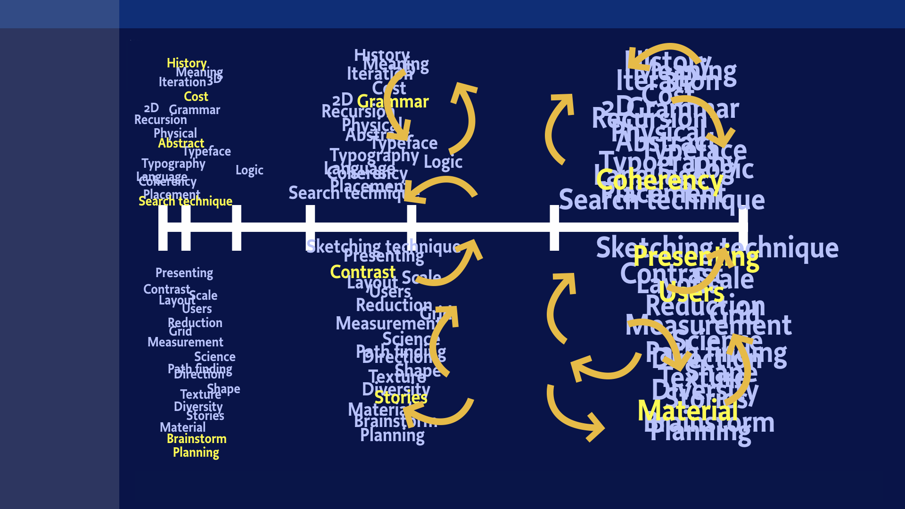

~~~Python
box = page['Featured']['Side']
~~~

## Repeat to improve
What makes a design proces fundamentally different from a production process, is that repetition improves the result. Starting with quick sketches, ignoring most details, next steps take more time. It’s not a lineair process, it’s an iterative process, which means repeating the previous step in more detail. 

~~~Python
box = page['Main']['Content']
~~~

## *Design Design Space*
### What is it?
*Design Design Space* is an online coaching environment to develop your design skills. Query your questions and improve your sketching. Acquire new techniques and research your presentations. In short, a space where you can design your design process. 

What kind of challenges do you experience in your daily work as a designer?

Working closely together online with experienced designers and a group of colleague students, there is space to define your own study topics and challenges. In fact, such a selection and planning process is an integral part of the study itself. You tell us what you want, and together we’ll find a way to get there.

### How much time do you need?
The core idea behind designing the design process, is that it doesn’t make a difference for how long you do it. A project of 1 hour, basically goes through the same stages (research – design – presentation) as a project of 1 year. Where in practice 80% of the work is done in the last 20% (or less) of the available time.

Of course, it matters how long you study. the stadia in the design process are fundamentally the same. Depending on the lenght of time, their will be more details to focus and to work on.

This mismatch – how time is spent on what – is fundamental to design. Too optimistic in the beginning (“There is still plenty of time”), a design is never finished (“The next one always will be better”). However, the fact that most designs are supposed to meet external requirements, the final deadline may have a much larger impact on the quality of the result, than the personal opinion of the designer.

### 1 day • 1 week • 1 month • 1 season • 1 year

Study path lengths range from 1 day, 1 week, 1 month, 1 season and possibly 1 year, whatever fits best to your plans, your practical possibilities and your financial situation.

### What does it cost?

* 1 day $150
* 1 week $900 (7 days)
* 1 month $1.900 (calendar month)
* 1 season $3.900 (3 calendar months)
* 1 year $7.900

Discount or split payment for the month, season and year trainings can be discussed, depending on your personal situation.

Students who whish to extend one training level into another, a 50% reduction is applied on previous payed tuition. E.g 1 day followed by 1 week: 1/2 $150 + $900 = $975. Or 1 week followed by 1 month: 1/2 $900 + $1.900 = $2.350. Or 1 week followed by 1 season: 1/2 $900 + $3.900 = $4.350

Pricing is for individual designers. For corporate trainings or groups, please <a href="mailto:buro@petr.com">contact us</a>.

### What is the schedule & how to submit?

Every 6 months, in March and September, a new day-week-month-season-year sequence starts, most likely if there are at least 3 participating students. 

Day-week sequences or single day Design Games can take place on other dates during the year, if the amount of participants makes it possible.

Since working as a team of students a minimum amount of 3 is required, and also a mininum level of quality, motivation, dedication and experience. 

Season and year-students are submitted after showing their portfolios and the result of a given assignment. Also they are asked to write a motivation and development plan.

Students finishing a training adequately, automatically get accepted for a next.

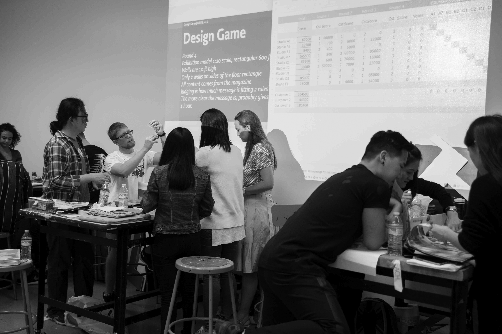
*Design Game on location at <a href="https://www.otis.edu" target="External">OTIS College of Art and Design</a>. Although the online training obviously doesn’t include this direct way of working together, it is the aim to offer the best possible online design space, using the latest technology.*

~~~Python
box = page['Main']['Side']
~~~

*What does your design profession look like 5 years from now? Or 20? Will your current skill set still be sufficient? How to make yourself independent from the changes in design that are likely to happen? Or better, how can you use them to our advantage?* Read what *Design Design Space* has to offer.

~~~Python
box = page['Footer']
box.html = doc.footerHtml

page = doc.newPage(title='How', name='how.html', template='home')
page.info.cssPath = 'sources/pagebot.css'

box = page['Introduction']
~~~

### If your design is finished, and you are satisfied with the result, what is it that your are satisfied with? 

~~~Python
box = page['Main']['Content']
~~~

## How does it work?

Design students meet online with each other and the coaches in regular intervals.

For interaction and exchanging documents a range of techniques are available, e.g. Skype, Google Hangout, Google Docs, offline video, Dropbox, Github, FaceTime and Second Life, to name a few. Selection and usage is topic of one of the assignments.

### Assignments
Students get assignments for imaginary design projects, with time frames ranging from several hours to several months. The assignments are challenges, where the specific topics can be filled by the individual students.

Questions how to approach these challenges, research on what skills need to be developed, what knowledge needs to be acquired and what techniques/materials need to be developed and how to design the planning for the project, are all part of assignments. 

With regular intervals (ranging from hours to days to once per week) the various levels of intermediate results are presented to the group of students and coaches. It is the aim of the coaches to create a safe environment in which anything can be said about any aspect of the work and the process.

### Safe environment
The process of creating such a safe environment and the methods for feed-back themselves are part of the assignments, and therefor subject to sketching and modification too.

In the presentations feed-back is given on the presented work, but also on the presentation itself and on the process and proceedings between presentations. 

<!--
## http://designdesign.space
## designdesignspace.com
-->

*Students are offered models for what the design process can be. And they are encouraged to created their own, and apply them to their designs.*

### Design methods
In the past a magnitude of design methods have been developed, but unformtunately most of them focus on production techniques and deadlines.
You may recognize that in your current design practice.

What most design methods don’t do is create space for designers to develop themselves. To allow unintended mistakes. Cuddle solutions that don’t seem to be profitable right away. To spend time on acquiring skills without predefined purpose.

Yet, for the development of skill, such an approach is essential. 

*Design Design Space* offers that environment. To study a specific topic for a defined period of time. Offering challenges, feed back, techniques and design methods that are customized to your development.

### Experience

*Design Design Space* taps into 35 of studio projects and over 50 years of combined experience of design education. Projects ranging from corporate identities, type design, typographic software, interiors, environmental design and running Design Games.

Tuition needs to be payed before the training starts. 
No refunding is possible, but participants have the right to build in breaks for some period of time, if that is discussed before hand. 

~~~Python
box = page['Section']['Title']
~~~
## Play games with your client, rules for recognizing identities.

~~~Python
box = page['Section']['0']
~~~
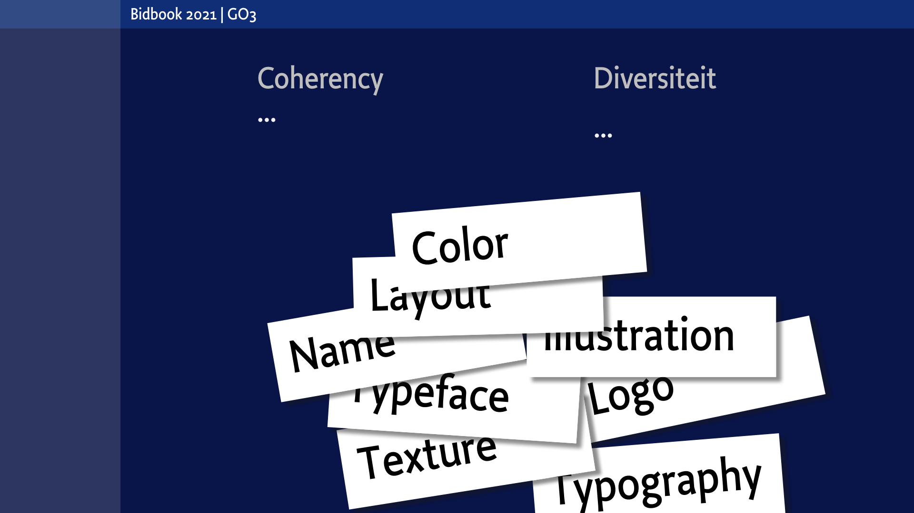
Imagine to ask a client which of the visule design parameters will be used for coherency or diversity. E.g. color cannot be the main recognition (“red”) and differentiate at the same time. 

~~~Python
box = page['Section']['1']
~~~
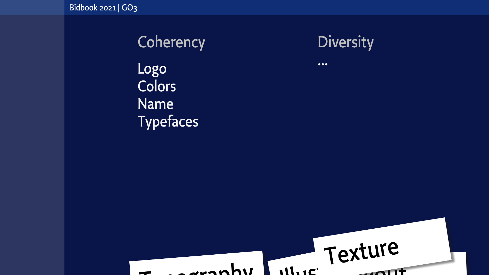
Nine out of ten clients will confirm that their ideal identity is best defined by a single logo, with consistent use of color, name and typeface. 

~~~Python
box = page['Section']['2']
~~~
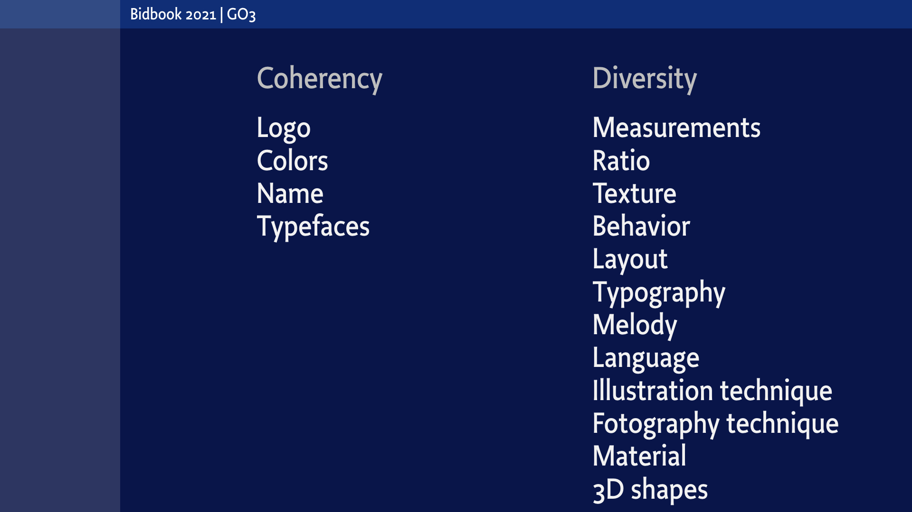
This means that all other parameters don’t have to be defined. Layout, texture, typography and language are not supposed to contribute to recognition of a brand.

~~~Python
box = page['Section']['3']
~~~
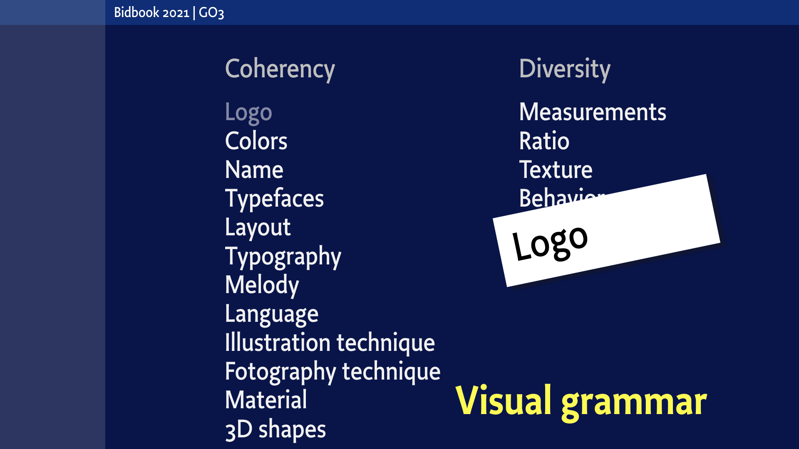
Or going one step further: if most of the other parameters are consistently used, they may allow a variation of different logo’s.

~~~Python
box = page['OtherMain']['Side']
~~~

*Developing sketching techniques should be an important part of any design study.*

*Arranging a collections of objects in arbitrary order, the layout is hard to remember and to reproduce.*

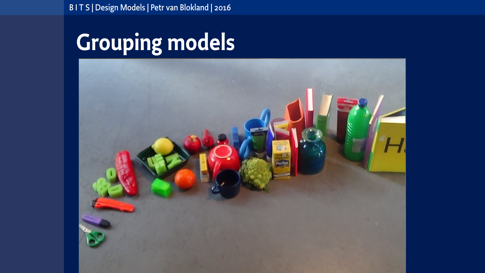
*If objects are ordered by height, it needs some time to recognize the rule. But after that, it can be applied to any set of objects.*

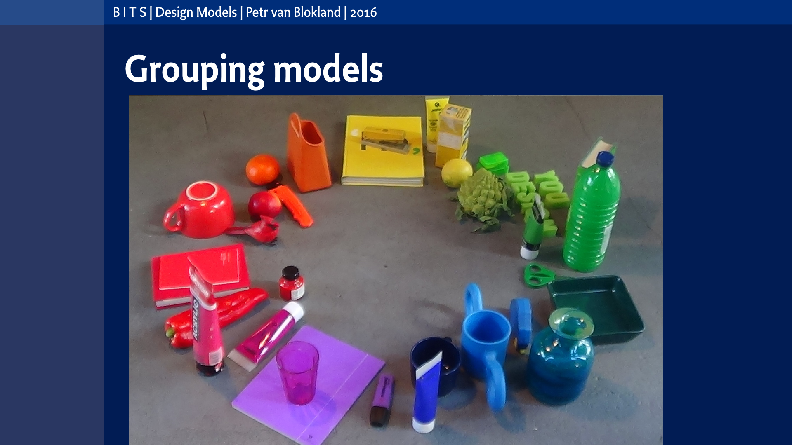
*Ordered by color, the rule is instantly clear, without the to mention to the viewer. This can easily be reproduced.*

~~~Python
box = page['OtherMain']['Content']
~~~

### What *Design Design Space* can be

* A personal environment to develop design skills, by accepting design challenges, meeting with coaches and colleage students in online feed-back sessions and presentations.
* The design of personal space (time, topic and skills) profession preparation for the rest of your life.
* a part-time sabbatical or a virtual internship
* a place to train design skills and tools.

### For whom?

* Graduated designers;
* Designers with experience, working in practice;
* Designers interested in improving their process;
* Designers interested in specializing a specific topic;
* Designers interested to develop skill that make them independent from future developments.
* Designers who would like to do a follow-up refresh study, but are lacking time, finance or geographic location to make that work.

In general the aim is to get graduated students as well as experienced designers back to a space of “WOW!”.

Focus is on design students and their individual goals. Not on predefined course content.

As designer, doing the Design Design Space study, you are open minded and willing to get valuable feedback on your work.

You are interested to improve and change and to participate in the work of colleague students.

You are disciplined to work hard between online sessions, and more interested in the development of skills and challenging assignments than in assessed diploma’s.

### What *Design Design Space* is not

* It is not an (online) course;
* It is not an (academic) study, leading to Master or PhD;
* It is not a school;
* It is not a “How to InDesign/HTML/CSS/JS/otherDesignTool” training;
* It is not a series of slides or a stack of books (although they may be very well part of it).

~~~Python
box = page['Main']['Side']
~~~

*Many of the assignments need collaborating with other online students, who – throughout the process – can have different roles, ranging from colleague and client to user.*

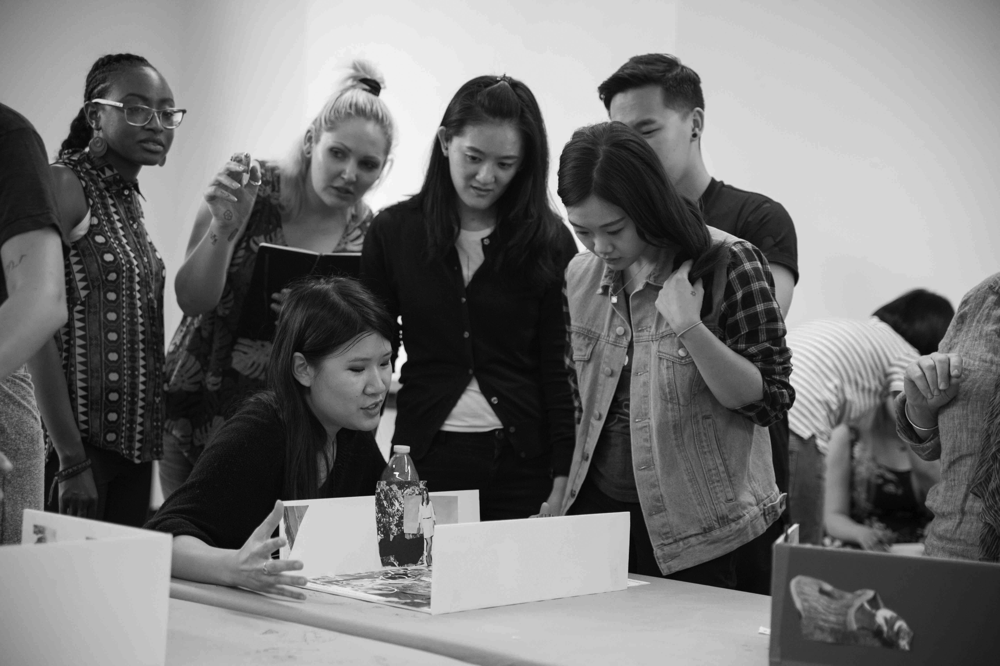
*Design Game on location at <a href="https://www.otis.edu" target="External">OTIS College of Art and Design</a>. Besides the development of sketching methods, the design of feedback methods is an important and integral part of every Design Design Space study*

~~~Python
box = page['Footer']
box.html = doc.footerHtml

page = doc.newPage(title='Game', name='game.html', template='home')
page.info.cssPath = 'sources/pagebot.css'

box = page['Introduction']
~~~

### Scaling the entire design practice down to a simulation of a couple of hours, how does that work?  

~~~Python
box = page['Main']['Content']
~~~

## Online Design Game
### Duration 8 hours

For those who ever did a Design Game on location, you’ll recognize the idea behind it. Doing one online, however, will be a new experience.

For those who never did a Design Game, this is a good way to start thinking about your design profession in a totally different way. 

### Preparation
The time frame of an online Design Game, depends on the time zones of the participants. We’ll try to make it as convenient as possible, yet it could be that yours starts at early dawn or late evening. Isn’t that just like working for international customers, expecting you to work on flexible parts of the day?

Virtual studios are formed from 3 or more designers. Since you are likely not in the same physical place or time zone, it is part of the game to find a way of working together. Improvisation is a form of design.
As studio you may want to consider dividing tasks depending on experience and interests.

Design Design Space is a transparant learning environment, where the online Design Game is the most condensed example.

There will be several studios working in a pitch for the same assignment for the same customer. At the end of each round the design get approval points.

The aim is that the best performing studio after 4 rounds wins the game.

In each round a new assignment is given, where the formation of the studios stays the same. This way experience on what went right or wrong in the previous rounds can be used to improve the next result.

### Round 1: Corporate Identity
The first round takes 2 hours to design and present a corporate identity. Details and requirements are given at the start of each round. 

Studios have the possibility to present to their customer through digital media, e.g. by e-mail and hangout, asking questions, showing intermediate sketches.

At the end of each round, the final design of every studio is presented to their customers and the other studios. The customers will judge the process and the result and give feedback.

Scores of each round are visible to the group in an online document.

### Round 2: Another Corporate Identity
The second round is similar to the first round – a new corporate identity, different requirements for another customer – but in shorter amount of time.

### Round 3: Magazine
Design and present different types of pages of a magazine. The challenge with working in an virtual environment, is to divide the work between the designers of the studio. What visual parameters define the difference between the types of pages and which parameters make the visual coherence?

### Round 4: Exhibition
Design and present an exhibition space, that fits the given requirements. With photos and video a physical scale model is presented to the customer and the other studios.

In this round all studios will judge and comment the result of all other studios. That feedback is used as part of the final score.
 
### Presentations and feedback
In a presentation where are designs can be compared, a winner is selected. 

### Conclusions
Concluding the 1 day of Design Design Space, feedback is given to the studios and individual designers. What went well? What were challenges? 

#### Trained skills
During the Design Game, several design skills are addressed. 

* Organizing, time management, asking interventions
* Management of detail levels
* Development of sketching techniques
* Communication between designers in a virtual studio
* Asking the right questions to the customer
* Selection of presentation media
* Judging and formulating feedback to other studios

Particpating in the Design Game is required for the extending studies at Design Design Space. From here students can choose to apply for one of the 1 week, 1 month, 1 season or 1 year extended programs.

~~~Python
box = page['Footer']
box.html = doc.footerHtml

page = doc.newPage(title='Projects', name='projects.html')
page.info.cssPath = 'sources/pagebot.css'

box = page['Introduction']
~~~

### What is it you want to specialize in, but never found the time and discipline?  

~~~Python
box = page['Main']['Side']
~~~

*Sketching is the process of eliminating unwanted options from the tree of all possibilities, without visualizing every single one of them.*

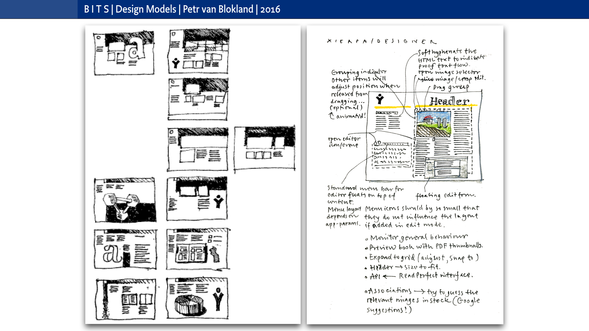
*Sketching is the process of managing the level of details, throughout the process. One method is reduce the scale of drawings, as the resolution of tools (pencil or screen) automatically will hide irrelevant details.*

~~~Python
box = page['Main']['Content']
~~~

## What can you do?

#### What can you do in 1 day?

* Play an online Design Game, with a schedule described <a href="game.html">here</a>.

#### In 1 week
One or more of these examples. How much can you fit in a week?

* Design a model exhibition space;
* Sketch the basics of a corporate identity;
* Design a gridded page or a scripted info-graphic
* Draw a couple of <a href="http://typecooker.com" target="External">TypeCooker</a> words with feedback;
* Write code for a DrawBot animation;
* Examine how to select one of the above.

#### In 1 month?
A selection of these examples. Or one of your own topics?

* Study typographic parameters;
* Research, write, design and present a mini-thesis about a topic of your choice;
* Design a simple corporate identity;
* Or program the manual in PageBot;
* Simulate a graphic design studio;
* Design a Design Game and run it;
* Fill a Moleskine with 100 sketch pages. Then select the best.

#### In 1 season?
A selection of these examples. Or what would you like to do?

* Develop a PageBot publication;
* Improve your sketching skills;
* Make some RoboFont tools;
* Design design education tools, such as games and feedback models;
* Do almost any design project that can be done in a month.

#### In 1 year?
A selection of these examples. Or maybe all? 

* Become an independent typographer with noticable experience;
* Improve your experience as type designer. Or as design educator;
* Design Variable Font design spaces;
* Become a designer, who knows how to write code;
* Or how to communicatie with professional programmers;
* You can ask a lot of relevant questions to yourself. Accepting that the answers take some more time;
* Design deep spaces.

## Specialization topics

In all of the five time frames (1 day, 1 week, 1 month, 1 season or 1 year) students can select a combination of specializations (where this selection process itself also is part of the design skills to be developed).
Essentially each time frame is a recursive copy of one of the others.
The difference between is the number of topics that can be addressed and the level of details possible.

### Applying topics, process and context
A combination of two or more topics from the list below, in combination with process and context selection, gives students a unique personal research environment for development.
Here a comparing set is show of two opposite values. E.g. is a system is “Episodic” it is possible to come back on earlier decision (as in a design process). If the system is “Sequential”, then the order is fixed (as in a game of chess).

#### Topics

* Typography
* Type design
* Design for fashion
* Design of information visualization
* Interior and exhibition design
* Design for multiple media from single source
* Parametric design, programming and coding
* Corporate identity design

#### Process

* Design of research methods
* Sketching techniques
* Design the design process
* Presentation techniques
* Design of feedback and evaluation techniques
* Design of testing methods

#### Contexts

* Design education
* Working in teams, running a studio
* Dealing with customers
* Design for users

Each of these items contains a world of detailed knowledge and design parameters that can be developed with other students who select such a topic. As example, for typography (and with reference to adjacent topics) this next level could contain a selection of:

* **Typographic parameters** Categories, bandwidth of possible values, presentation examples, …
* **Typographic layout** Principles, transformation of historic examples, whitespace, aesthetics, …
* **Typographic tools** Grid, type, size, leading, spacing, kerning, width, hyphenation, orientation, contrast, color, pattern, proportion, ratio, interaction, position, meaning, language, any combination and addition to the parameters of Bertin, …
* **Design the process** Base requirements, testing, planning, cooperation with other disciplines, research, marketing, promotion, difference between single solution and generative rules, selection and design of research methods, …
* **Mathematics for designers** Trigonometry, position, rotation, transformation matrices, column calculation, statistics, logarithmic, ranges, light game theory, principles of AI, neural networks and machine learning, …
* **Type design** Variation axes, design of parameters, design of selection criteria, design of the process, …
* **Images as typographic elements** Illustration, photography, info-graphics, ...
* **Target areas** Culture, fashion, politics, international relation, trade, education, …
* **Educating typography** Educating bachelor students, customers, users, yourself inside design cycles, presenting, writing about…
* **Programming** Structure, hierarchy, design of algorithms, …
* **Coding** All relevant languages related to typography: deepest relevant of Processing, Python, JS, PHP, CSS, HTML, XML, Objective-C, …
* **Tools** Deepest of Adobe applications, scripting, OSX-terminal tools, design of information conversion flows, research on raw data, …
* **Device Measurements** resolution, distortion, proportion, memory usage, …
* **Storage techniques** File, database, formats, git, JSON, plist, XML, UFO, …

~~~Python
box = page['Section']['0']
~~~
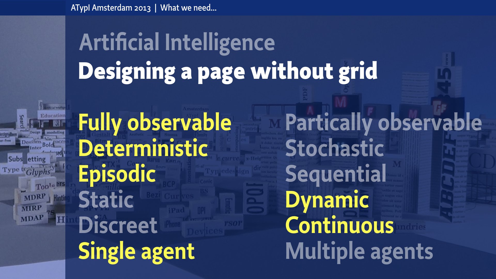
*Artifical Intelligence (AI) probably has much influence on any profession in the coming years. How will it influence your design practice?*

~~~Python
box = page['Section']['1']
~~~
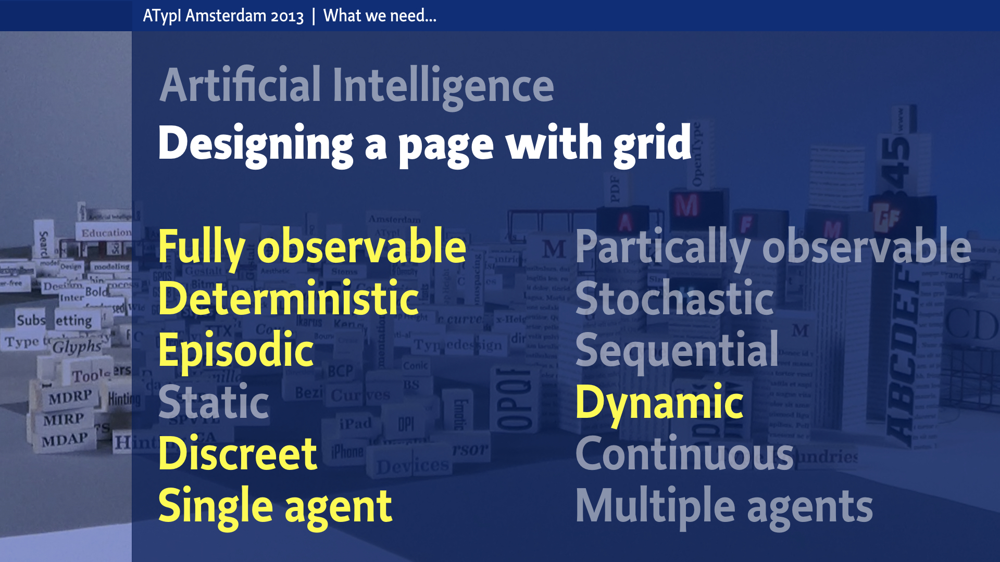
*Many models that apply to AI, also work in design. Those parallels can be subject of your study at Design Design Space.*

~~~Python
box = page['OtherMain']['Content']
~~~

## Assignments
Below some example assignments.

### Design of methods for selection and feedback 
3 posters, similar and different in one series, for a topic of your choice. Assignemnt is how to judge the result and how to select from various judging methods.
*How to develop criteria 

### Basic skills
Painting of color/gray ranges. Sketching with materials, proportions, ratio and contrast.

Although much of your work may have digital outcome, actually making stuff with real materials opens up new directions, other points of view.

### Sketching techniques
One week to fill a 100 page Moleskine sketchbook, design for a specific subject, context or design challenge.
The presentation is showing 5 best pages in combination with validation criteria used.

### Design of research methods inside the design process
This is the integral assignment for TypeMedia 2017 students at the end of their Master year. They have limited time of 2 weeks to write and design 3 mini-thesis document of one page each. Illustrated and documented.

### Design of an interactive poster
What is a relevant set of parameters for a poster? And how does interaction play a role in that? What is the design process? How do you test the intermediate result? What needs to happen to guearantee success?

### Design of models for corporate identities
Research models where publications within a corporate identity can have different usage, technique and message, and still visually belong to the same brand. What are parameters and what freedom do designers have later in the process?
Which of these parameters need to be documented? And which can be automated?

~~~Python
box = page['Footer']
box.html = doc.footerHtml

page = doc.newPage(title='About', name='about.html', template='home')
page.info.cssPath = 'sources/pagebot.css'
box = page['Main']['Side']
~~~

~~~Python
box = page['Main']['Content']
~~~

### Petr van Blokland

Petr van Blokland (1956, Netherlands) graduated cum laude from the graphic arts program at the Royal Academy of Fine Arts (KABK) in The Hague in 1980.

With his partner Claudia Mens, Van Blokland worked for over thirty-five years as a designer in the studio they cofounded. His output ranged from sketching and model-making to programming in various languages. He specialized in systematic design: corporate identities, form systems, online publications, and tools for type design.

Van Blokland has taught graphic design, typography, and type design for many years at the Royal Academy of Fine Arts (KABK) in The Hague and at the Academy of Fine Arts, Arnhem. His first typeface was Proforma, a large series commissioned by Purup, a Danish manufacturer of form-preparation systems. Proforma has now been released for general use through Type Network. In 1988, Van Blokland’s work brought him ATypI’s coveted Charles Peignot Prize.

As cofounder and partner of Type Network, Van Blokland is a dedicated contributor and developer of new type and tools for type design. He currently teaches in the Master’s program in Graphic Design at AKV|St.Joost in Breda and at Type and Media, the postgraduate type design program at KABK in The Hague. Read more about his thoughts on design and education in this interview and in his Lubalin lecture, <a href="https://vimeo.com/133052206" target="External">Words</a> delivered at Cooper Union in 2015.

~~~Python
box = page['OtherMain']['Side']
~~~

~~~Python
box = page['OtherMain']['Content']
~~~

### Claudia Mens

Claudia Mens (1957, Netherlands) graduated from the Interior Design program at the Royal Academy of Fine Arts (KABK) in The Hague in 1985. Then she studied at the Master Environmental Design and graduated in 1989 at the KABK as well. 

With her partner Petr van Blokland, she worked and ran the studio van Blokland + Mens for over twenty five years as designer. 

Before she became a designer, she worked as a school and career counselor for a couple of years. In the recent years she has developed as a trainer coach.

Besides her studio work, she has taught at the KABK for over twenty years at the Graphic Design department.

In 2016 she initiated <a href="peppertom.com" target="External">Pepper+Tom</a>, a self initiated project. P+T is “a playing ground” where she presents her series of designed and produced skirts and scarfs. 

Both products are “people’s projects”: working together with a group of professionals under sustainable circumstances, with eco friendly fabrics, under the conditions of “slow fashion”. 

### Crew of others…
Depending on necessary domain knowlegdge, other designers and professionals can be added to the team. Former students, collegue designers, lectureres and relations of the studio are available if that fits the topics at hand.

~~~Python
box = page['Footer']
box.html = doc.footerHtml
~~~

